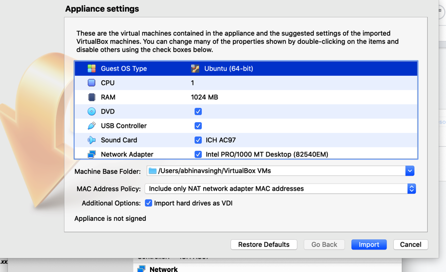
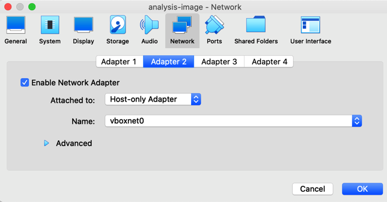
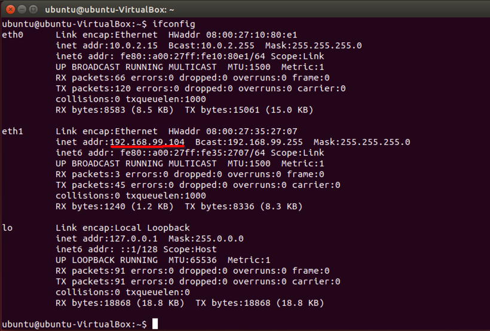

## Getting Started

**Step 1:** Download or clone the starter repo.

**Step 2:** Download a copy of the [ubuntu.ova file from S3](https://udacity-send.s3-us-west-2.amazonaws.com/analysis-image.ova). Don't be concerned if it takes some time to download. If 30 minutes passes and the file has not downloaded, cancel and reattempt the download. If it's still not successful, please reach out to Udacity staff.

**Step 3:** Download & install Oracle VirtualBox software which will be used as our virtualization tool for loading the OVA file downloaded above. [You can download it here](https://www.virtualbox.org/wiki/Downloads).

**Step 4:** Download and Install Docker Desktop for its official website. Depending on your operating system, you can follow one of the below links to download and set up docker on your computer. 
- [Windows](https://docs.docker.com/docker-for-windows/install/)
- [MacOS](https://docs.docker.com/docker-for-mac/)
- [Linux](https://docs.docker.com/engine/install/ubuntu/)

### Installation

**Step 1:** Double click or right-click on the OVA file to load it in Virtualbox. You will be presented with an Appliance settings page which will reflect the virtual machine’s settings and configuration. Click on Import to begin creating the virtual machine on your computer. 



**Step 2:** Allow the installation to complete. It will take a few minutes before the virtual machine is up and running.

**Step 3:** Your VirtualBox Manager will now be reflecting the virtual machine. Click on "Settings" and navigate to the "Network" tab. Make sure that the Adapter 1 is selected as NAT and Adapter 2 is selected as "Host-only Adapter". You can also tune the other settings based on your preference. Click "OK" to proceed. 



**Step 4:** You are now ready to launch the virtual machine. Click on "Start" to begin loading the Ubuntu OS as your virtual machine. 

**Step 5:** Keep a note of the default username and password of the ubuntu linux which is already created for you. 
- _Username:_ `ubuntu` 
- _Password:_ `ubuntu`

**Step 6:** Once the Desktop is loaded, open the terminal in Ubuntu and run the command `ifconfig` to list the available interfaces and their IP addresses.

**Step 7:** Note the IP address associated with eth1. It should be in the form of `192.168.xxx.xxx`. 



### Testing

**Step 1:** Open the terminal in Ubuntu VM and run the command `ipconfig` to list the available interfaces and their IP addresses.

**Step 2:** Note the IP address associated with eth1. It should be in the form of `192.168.xxx.xxx`. 

**Step 3:** Come back to your host operating system and launch the command prompt or terminal. Run the command:
``` 
	ping 192.168.xxx.xxx
```
If the packets are successfully getting delivered, it means that your guest operating system (virtual machine) is accessible from the host operating system.

## What Are We Doing?


**South Udan** is a small island nation that is a peaceful and technologically advanced nation! Because of its small size, the country believes in efficiently using its land and natural resources. Their scientists recently came up with a novel and cleaner means of performing nuclear fission of an element called Tridanium. This allows them to generate 100 times more energy and drastically reduce nuclear waste, thus making it the most efficient and clean way to generate electricity. This enabled them to generate cleaner and cheaper electricity, thus improving the lives of their citizens.

**North Udan** was extremely jealous of the progress of their neighbors. They still rely on using coal and other fossil fuels which are known to speed up global warming. In order to disrupt South Udan program, the government of North Udan decides to launch a cyberattack on South Udan Tridanium processing plant and disrupt its operation. 

**The National Peace Agency of North Udan**, which is an undercover organization that runs the nation-state espionage program, launches an attack during a national holiday in South Udan (the holiday marks 50 years of border separation of the two nations). They manage to compromise a linux server which serves as a jump host to connect the Tridanium processing plant to the internet. They attempted to brute force the password of an employee account which triggered a security alarm. You have been immediately called onboard to respond to the security alarm and contain the ongoing cyberattack. You will begin the investigation from the compromised jump box to detect and mitigate the threats. Since it's a mission-critical server, you are also tasked with immediately hardening the server to proactively defeat future attacks from North Udan. 

## Section 1: Threat Detection


### Task 1: ClamAV scan
As a first threat detection measure, you will have to perform an antivirus scan on the system to determine the malware files planted by the National Peace Agency on the processing plant’s server.
Launch ClamAV malware scanner and perform a scan on the ‘Downloads’ directory. Report all detections in the `clamAV_report.txt` file. 

### Task 2: Suspicious File Identification
You know that the National Peace Agency has an advanced infiltration group. As a curious investigator, you still want to explore other files available in the Downloads folder, despite the ClamAV scan detecting some files as malware. Can you spot _one more suspicious file_ which should have been a cause of infection but managed to defeat your ClamAV scan? Find this filename and the embedded callout URLs hardcoded in this file. This callout domain is the Command & control server of the National Peace agency. Report this finding in the file `suspicious_file_report.txt`. 

### Task 3: Yara Rule Creation
Once you have ensured the presence of a unique malware file that could not be detected through ClamAV scan, you also want to ensure that there is a signature or rule in place so that you can scan your other servers for the presence of the same file. Create a Yara rule file named `unknown_threat.yara` which can be compiled with ClamAV to detect the unique malware you have identified in the task above. 

## Section 2: Threat Mitigation


### Task 1: Implement HIDS
The first security alarm about the ongoing cyberattack came from the Host-Based Intrusion Detection System is about multiple failed login attempts from a foreign IP address. Launch the host IDS and analyze the logs and events captured in the system. To verify that the IDS is up and working, try connecting to the virtual machine via SSH and notice the new login entry created in the IDS web UI.
Take a snapshot of the newly created log lines and name it `succesful_ssh_logon.png`. This will ensure that the IDS system is working as expected and capturing logs in real-time. 
Once you have taken the snapshot, upload it to the `/starter/section_2/ directory`. 


### Task 2: Locate Suspicious IP
Once you have verified that the IDS is working fine, you are now required to collect the next indicator of compromise(IoC), which is the IP address that attempted to break into the system. This IoC will prove significant in attributing the threat actors behind the cyber attack. You were told that the initial security alarm consisted of multiple failed login attempts on the jump host server. To verify that, filter the IDS alerts to specifically look for failed logins followed by a successful one. To further disrupt the network after a successful login, the attackers execute a command to elevate their privilege to system root. Your goal is to identify that IP address which made the logon attempts and then performed privilege escalation to the ‘root’ user. Report the IP address in the `attacker_IP.txt` file. 

### Task 3: IPtables Rule
Once you have identified the attacking IP address, you are now required to create an IPtables rule to make sure that any SSH connection requests from this host are blocked in the future. Hopefully, this will stop this agent from the so-called National Peace Agency from connecting again. Report your IP table rule in the `Iptable_rule.txt` that will deny SSH access to the attacking IP. 

### Task 4: Detect Backdoor Username, Process & Port
Once the attackers managed to break into the system, they created a backdoor username and launched a process that allows them to log in through a non-standard port number. This is a common tactic implemented by nation-state actors to ensure continuous access to the compromised system. Your goal is to identify the rouge username added by the attackers and locate the malicious process and the remote port it is listening on. Both IDS logs as well as system commands can be used to perform this task.  Report these three details in the `backdoor_details.txt` file. Delete the rouge username and kill the backdoor process to remove the persistence created by the attackers. 

### Task 5: Disable SSH Root Access
So far, we have figured out that the attack was carried out through brute-forcing ssh login credentials. Can you update the SSH configuration file to ensure that root login through SSH is never allowed, even if the correct set of credentials have been used? Report your changes by modifying the respective configuration entry and providing a snapshot of the change you have made. Name the file as `remote_config_change.jpg`.

**As an _optional stand out task_**, you can also provide a set of best practice recommendations to the senior leadership about further securing the remote login process and password management in the organization. While you appreciate the job security, you also don't appreciate the National Peace Agency making you come in on your day off. Provide your recommendation in the `additional_remote_security_recommendations.txt` file. 

## Section 3: System Hardening for Enhanced Security


### Task 1: OpenVAS Scan
Now that the cyber-attack has been successfully contained, you are also tasked with further hardening the jump host server. As a first step, perform an OpenVAS vulnerability scan on the system and provide a snapshot of the vulnerabilities identified by the scan. Name the snapshot as`openvas_vulnerability_report.png`. 

### Task 2: Patching Apache
Once you have provided your report on the existing vulnerabilities on the system, you notice that the jump host is also running an Apache HTTP server which can be accessed from the internet and can serve as an attack point in future incidents. To harden the Apache server, you must remove the version banner from being publicly visible.  This would make it difficult for an attacker to perform reconnaissance on the server and launch attacks. Your goal is to identify and report the current Apache httpd server version and then the configuration change required to prevent the version number benign publicly accessible. Report both these details in the filename `apache_version_patching.txt`. 

### Task 3: De-Privilege Apache Account
As a final task of hardening the system, you want to ensure that Apache always runs as a low privileged user with restricted system access. To do that, create a new user group called “apache-group” and a new user account called `apache-user`. Can you list the configuration changes you’ll have to make sure that Apache launches with this new user account and group name? Provide your response in `apache_user_account.txt`. 


### Optional Stand Out Task:

The head of security for South Udan is grateful to you for your services. They want to award you with a commendation, and you are asked to prepare an “Executive Summary” of the entire investigation and changes you have made to contain the threat. This executive summary will be used to brief the head of South Udan about the incident. You can provide your summary in the form of a PDF, Word or text file, depending on whether you want to use only text or add images. Name the file as “Executive_summary” and upload it to the `section 3` directory itself. 

## Project Submission

For your submission, please submit the following:
1. Section 1:
 - `clamAV_report.txt` with answers.
 - `suspicious_file_report.txt1` with answers.
 - `unknown_threat.yara` with your rule.
2. Section 2:
 - `Iptable_rule.txt` with your answers.
 - `additional_remove_security_recommendations.txt` with your answers.
 - `attacker_IP.txt` with the IP address.
 - `backdoor_details.txt` with your answers.
 - `remote_config_change.png` with your screenshot.
 - `successful_ssh_logon.png` with your screenshot.
3. Section 3: 
 - ` apache_user_account.txt` with your answers.
 - `apache_version_patching.txt` with your answers.
 - `openvas_vulnerability_report.png`with your screenshot.


